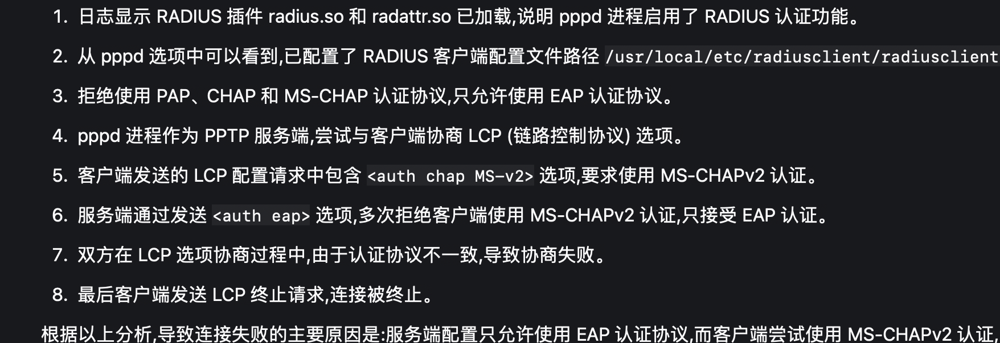

Jul 30 14:52:54 ip-172-31-30-39 pppd[16874]: 192.168.240.1:192.168.240.2#011#011# (from command line)
Jul 30 14:52:54 ip-172-31-30-39 pppd[16874]: nobsdcomp#011#011# (from /etc/ppp/options.pptpd)
Jul 30 14:52:54 ip-172-31-30-39 pppd[16874]: require-mppe-128#011#011# (from /etc/ppp/options.pptpd)
Jul 30 14:52:54 ip-172-31-30-39 pppd[16874]: pppd 2.4.5 started by root, uid 0
Jul 30 14:52:54 ip-172-31-30-39 pppd[16874]: Using interface ppp0
Jul 30 14:52:54 ip-172-31-30-39 pppd[16874]: Connect: ppp0 <--> /dev/pts/1
Jul 30 14:52:59 ip-172-31-30-39 pppd[16874]: Modem hangup
Jul 30 14:52:59 ip-172-31-30-39 pppd[16874]: Connection terminated.
Jul 30 14:52:59 ip-172-31-30-39 pppd[16874]: Exit.
Jul 30 14:52:59 ip-172-31-30-39 pptpd[16873]: CTRL: Client 13.229.98.36 control connection finished
c

正确的呢?

Jul 30 14:56:09 ip-172-31-30-39 pppd[17135]: ms-dns xxx # [don't know how to print value]#011#011# (from /etc/ppp/options.pptpd)
Jul 30 14:56:09 ip-172-31-30-39 pppd[17135]: proxyarp#011#011# (from /etc/ppp/options.pptpd)
Jul 30 14:56:09 ip-172-31-30-39 pppd[17135]: 192.168.240.1:192.168.240.2#011#011# (from command line)
Jul 30 14:56:09 ip-172-31-30-39 pppd[17135]: nobsdcomp#011#011# (from /etc/ppp/options.pptpd)
Jul 30 14:56:09 ip-172-31-30-39 pppd[17135]: require-mppe-128#011#011# (from /etc/ppp/options.pptpd)
Jul 30 14:56:09 ip-172-31-30-39 pppd[17135]: pppd 2.4.5 started by root, uid 0
Jul 30 14:56:09 ip-172-31-30-39 pppd[17135]: Using interface ppp0
Jul 30 14:56:09 ip-172-31-30-39 pppd[17135]: Connect: ppp0 <--> /dev/pts/1
Jul 30 14:56:12 ip-172-31-30-39 pptpd[17133]: CTRL: Ignored a SET LINK INFO packet with real ACCMs!
Jul 30 14:56:13 ip-172-31-30-39 pppd[17135]: Unsupported protocol 'IPv6 Control Protocol' (0x8057) received
Jul 30 14:56:13 ip-172-31-30-39 pppd[17135]: MPPE 128-bit stateless compression enabled
Jul 30 14:56:15 ip-172-31-30-39 pppd[17135]: Cannot determine ethernet address for proxy ARP
Jul 30 14:56:15 ip-172-31-30-39 pppd[17135]: local  IP address 192.168.240.1
Jul 30 14:56:15 ip-172-31-30-39 pppd[17135]: remote IP address 192.168.240.2

## 主动断了以后 ---
30 14:56:21 ip-172-31-30-39 dhclient[2313]: XMT: Solicit on eth0, interval 115670ms.
Jul 30 14:58:16 ip-172-31-30-39 dhclient[2313]: XMT: Solicit on eth0, interval 127250ms.
Jul 30 14:58:27 ip-172-31-30-39 pppd[17135]: LCP terminated by peer (6M-"bM-]^@<M-Mt^@^@^@^@)
Jul 30 14:58:27 ip-172-31-30-39 pppd[17135]: Connect time 2.2 minutes.
Jul 30 14:58:27 ip-172-31-30-39 pppd[17135]: Sent 4291 bytes, received 6452 bytes.
Jul 30 14:58:27 ip-172-31-30-39 pppd[17135]: Modem hangup
Jul 30 14:58:27 ip-172-31-30-39 pppd[17135]: Connection terminated.
Jul 30 14:58:27 ip-172-31-30-39 pppd[17135]: Exit.
Jul 30 14:58:27 ip-172-31-30-39 pptpd[17133]: CTRL: Client 13.229.98.36 control connection finished

---

Plugin radius.so loaded.
RADIUS plugin initialized.
Plugin radattr.so loaded.
RADATTR plugin initialized.
pppd options in effect:
debug		# (from /etc/ppp/options.pptpd)
logfile /var/log/pppd.log		# (from /etc/ppp/options.pptpd)
dump		# (from /etc/ppp/options.pptpd)
plugin radius.so		# (from /etc/ppp/options.pptpd)
plugin radattr.so		# (from /etc/ppp/options.pptpd)
auth		# (from /etc/ppp/options.pptpd)
refuse-pap		# (from /etc/ppp/options.pptpd)
refuse-chap		# (from /etc/ppp/options.pptpd)
refuse-mschap		# (from /etc/ppp/options.pptpd)
name pptpd		# (from /etc/ppp/options.pptpd)
radius-config-file /usr/local/etc/radiusclient/radiusclient.conf		# (from /etc/ppp/options.pptpd)
115200		# (from command line)
lock		# (from /etc/ppp/options.pptpd)
local		# (from command line)
novj		# (from /etc/ppp/options.pptpd)
novjccomp		# (from /etc/ppp/options.pptpd)
ipparam 13.229.98.36		# (from command line)
ms-dns xxx # [don't know how to print value]		# (from /etc/ppp/options.pptpd)
nodefaultroute		# (from /etc/ppp/options.pptpd)
proxyarp		# (from /etc/ppp/options.pptpd)
192.168.240.1:192.168.240.2		# (from command line)
nobsdcomp		# (from /etc/ppp/options.pptpd)
require-mppe-128		# (from /etc/ppp/options.pptpd)
using channel 81
Using interface ppp0
Connect: ppp0 <--> /dev/pts/2
sent [LCP ConfReq id=0x1 <asyncmap 0x0> <auth chap MS-v2> <magic 0x5ad5c4b> <pcomp> <accomp>]
rcvd [LCP ConfReq id=0x0 <mru 1400> <magic 0x3c4a6731> <pcomp> <accomp> <callback CBCP>]
sent [LCP ConfRej id=0x0 <callback CBCP>]
rcvd [LCP ConfReq id=0x1 <mru 1400> <magic 0x3c4a6731> <pcomp> <accomp>]
sent [LCP ConfAck id=0x1 <mru 1400> <magic 0x3c4a6731> <pcomp> <accomp>]
sent [LCP ConfReq id=0x1 <asyncmap 0x0> <auth chap MS-v2> <magic 0x5ad5c4b> <pcomp> <accomp>]
rcvd [LCP ConfNak id=0x1 <auth eap>]
sent [LCP ConfReq id=0x2 <asyncmap 0x0> <magic 0x5ad5c4b> <pcomp> <accomp>]
rcvd [LCP ConfNak id=0x2 <auth eap>]
sent [LCP ConfReq id=0x3 <asyncmap 0x0> <magic 0x5ad5c4b> <pcomp> <accomp>]
rcvd [LCP ConfNak id=0x3 <auth eap>]
sent [LCP ConfReq id=0x4 <asyncmap 0x0> <magic 0x5ad5c4b> <pcomp> <accomp>]
rcvd [LCP ConfNak id=0x4 <auth eap>]
sent [LCP ConfReq id=0x5 <asyncmap 0x0> <magic 0x5ad5c4b> <pcomp> <accomp>]
rcvd [LCP ConfNak id=0x5 <auth eap>]
sent [LCP ConfReq id=0x6 <asyncmap 0x0> <magic 0x5ad5c4b> <pcomp> <accomp>]
rcvd [LCP ConfNak id=0x6 <auth eap>]
sent [LCP ConfReq id=0x7 <asyncmap 0x0> <magic 0x5ad5c4b> <pcomp> <accomp>]
rcvd [LCP ConfNak id=0x7 <auth eap>]
sent [LCP ConfReq id=0x8 <asyncmap 0x0> <magic 0x5ad5c4b> <pcomp> <accomp>]
rcvd [LCP ConfNak id=0x8 <auth eap>]
sent [LCP ConfReq id=0x9 <asyncmap 0x0> <magic 0x5ad5c4b> <pcomp> <accomp>]
rcvd [LCP ConfNak id=0x9 <auth eap>]
sent [LCP ConfReq id=0xa <asyncmap 0x0> <magic 0x5ad5c4b> <pcomp> <accomp>]
rcvd [LCP ConfNak id=0xa <auth eap>]
sent [LCP ConfReq id=0xb <asyncmap 0x0> <magic 0x5ad5c4b> <pcomp> <accomp>]
rcvd [LCP TermReq id=0x2 "<Jg1\000<\37777777715t\000\000\002\37777777734"]
sent [LCP TermAck id=0x2]
Modem hangup
Connection terminated.
RADATTR plugin removed file /var/run/radattr.ppp0.

---

dictionary      /usr/local/etc/radiusclient/dictionary
dictionary      /usr/local/etc/radiusclient/dictionary.microsoft
dictionary      /usr/local/etc/radiusclient/dictionary.ascend
dictionary      /usr/local/etc/radiusclient/dictionary.compat
dictionary      /usr/local/etc/radiusclient/dictionary.merit
dictionary      /usr/local/etc/radiusclient/dictionary.sip

---
rc_avpair_new: unknown attribute 6
rc_avpair_new: unknown attribute 7
rc_avpair_new: unknown attribute 1
rc_avpair_new: unknown attribute 11
rc_avpair_new: unknown attribute 25
rc_avpair_new: unknown attribute 31
rc_avpair_new: unknown attribute 4 如何查询到不同的数字代表什么属性呢
---

radstatus 54.188.58.175:1812:Rd3$ckL7Hy9@Bq server